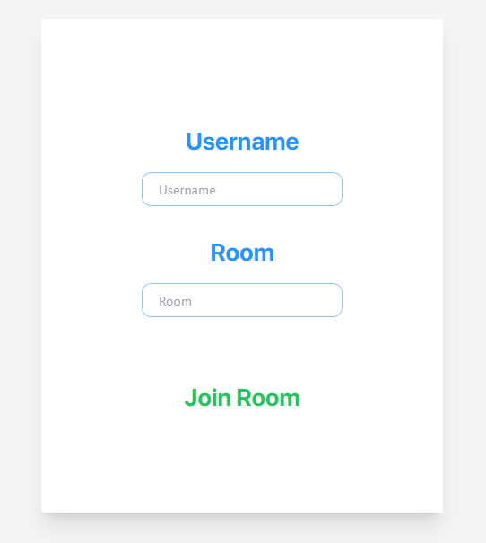
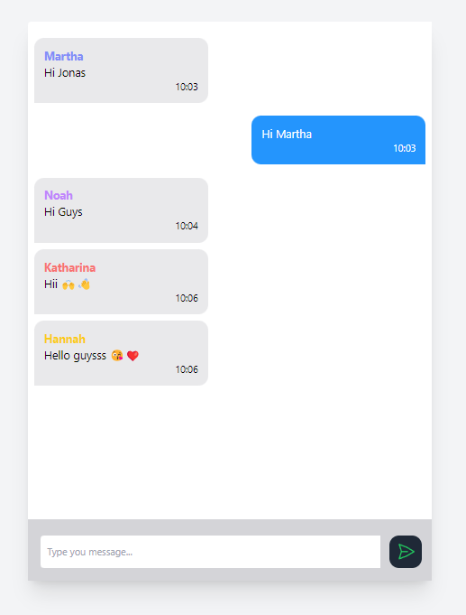

# Real Time Chat 💬

Realtime chat app made with ReactJS and socket.io.

## Features ✨

- ⚡ Real-Time Messaging: Instant delivery of messages using Socket.io.
- 🏠 Group Chat: Create and manage chat groups by room numbers.
- 📱💻 Responsive Design: Works on both desktop and mobile devices.
- 🔐 User Authentication: Join with a username and room number.
- 🤖 Guest Usernames: If no username is provided, a random guest name is assigned.
- 🚫 Unique Usernames: Prevents duplicate usernames in the same room.


## Technologies Used 💻


- 💻 [React.js](https://reactjs.org/) - JS library for crafting user interfaces 
- 📦 [Vite](https://vitejs.dev/) - Module bundler 
- 🎨 [Tailwind CSS](https://tailwindcss.com/) - A utility-first CSS framework
- 🚀 [Express.js](https://expressjs.com/) - Web framework for Node.js
- 📡 [Socket.io](https://socket.io/) - An event-driven library for real-time web applications
- 🌐 [Cors](https://www.npmjs.com/package/cors/) - Mechanism for integrating applications


## Installation 🛠️

Prerequisites

- Install Node.js ⚙️
- Clone the repo 🔄

 📦 After cloning the repo install dependecies with

3. Open up two terminal instances and run scripts below in directories `/server` and `/client`

- Server
 ```sh 
    npm i && node index.js
```
- Client
 ```sh 
    npm i && npm run dev
```
after running scripts go to `http://localhost:5173` with your browser to use the app. 🌐

## Usage 🚀

**1: Join a Room**
- Enter a username and room number to join. ✍️
- If no username is provided, a random guest name will be assigned. 🎲

**2: Start Chatting**
- Join existing chat groups or start a new conversation.💬
- Enjoy real-time messaging with other users. 😃

**Step 3: Rejoin Capability**
- Users can leave and rejoin the room using the same username and room number.🔄


### Screenshots 📸

<div style="display: flex; flex-direction: row;">
    
    
</div>


## License 📄

[MIT](https://choosealicense.com/licenses/mit/)
